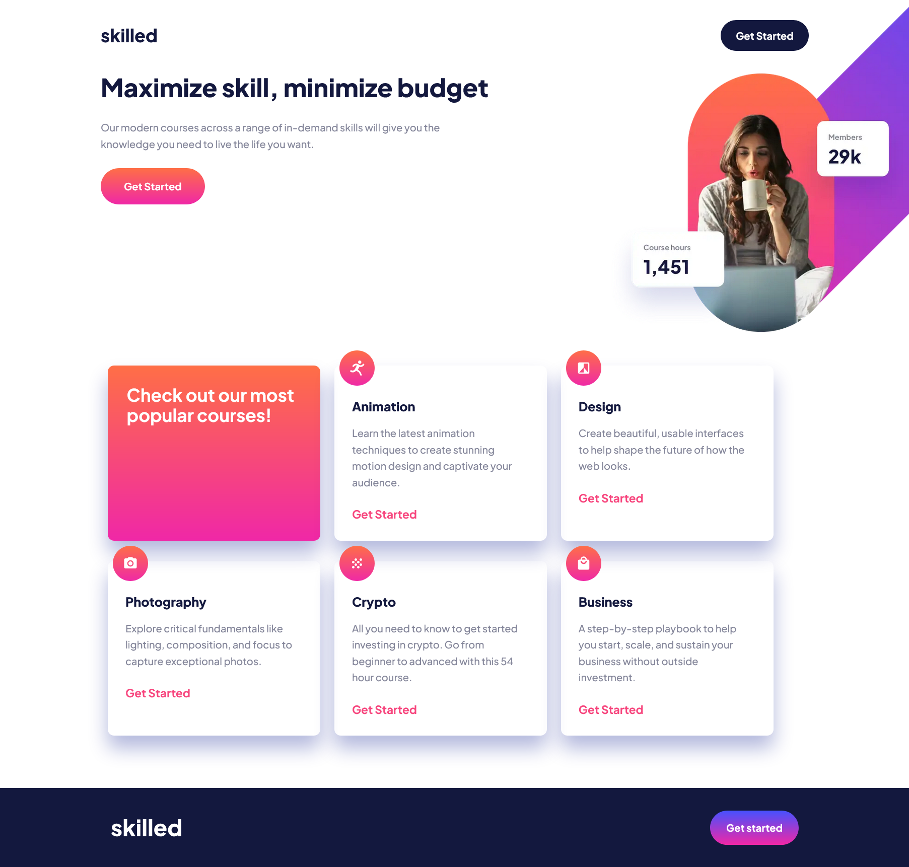
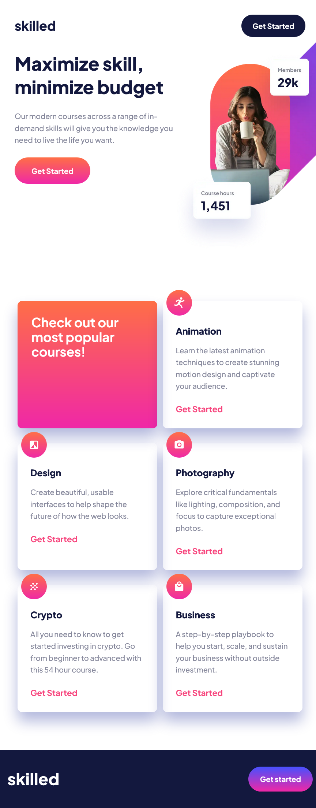

# Frontend Mentor - Skilled e-learning landing page solution

This is a solution to the [Skilled e-learning landing page challenge on Frontend Mentor](https://www.frontendmentor.io/challenges/skilled-elearning-landing-page-S1ObDrZ8q). Frontend Mentor challenges help you improve your coding skills by building realistic projects.

## Table of contents

- [Overview](#overview)
  - [The challenge](#the-challenge)
  - [Screenshot](#screenshot)
  - [Links](#links)
- [My process](#my-process)
  - [Built with](#built-with)
  - [What I learned](#what-i-learned)
  - [Continued development](#continued-development)
- [Author](#author)

## Overview

### The challenge

Users should be able to:

- View the optimal layout depending on their device's screen size
- See hover states for interactive elements

### Screenshot

### Links

- Solution URL: [My repo](https://github.com/dralveol/skilled-elearning-landing-page)
- Live Site URL: [Live site](https://dralveol.github.io/skilled-elearning-landing-page)

## My process
### Built with

- Semantic HTML5 markup
- Sass
- Flexbox
- Mobile-first workflow

### What I learned

Using mixins with sass

### Continued development

Why do we have so much hero image types ?
Is the nav choice semantically appropriate ? At first i went for section but section needs a heading so i went for nav since it references diverse options of the skilled learning page

## Author

- Frontend Mentor - [@dralveol](https://www.frontendmentor.io/profile/dralveol)